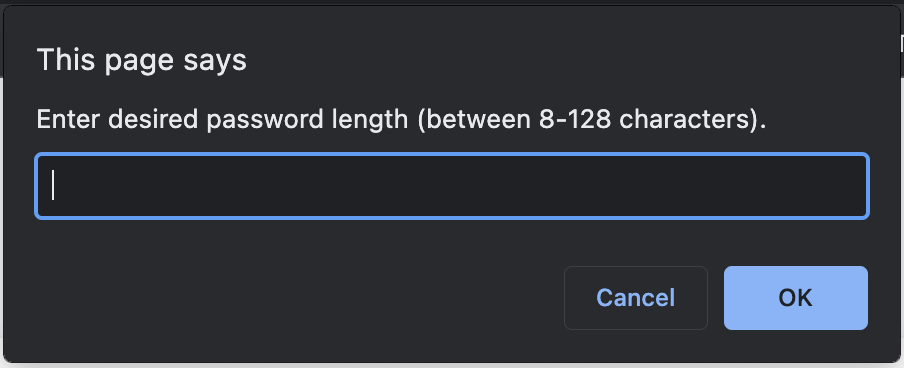
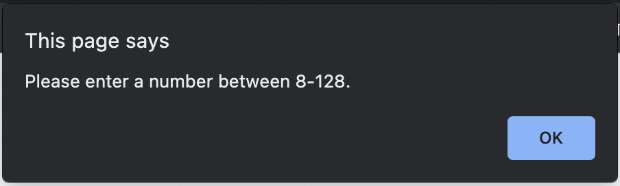
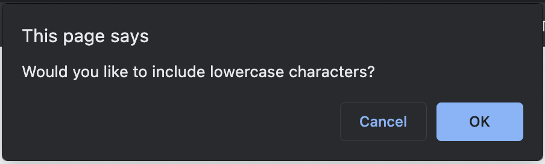
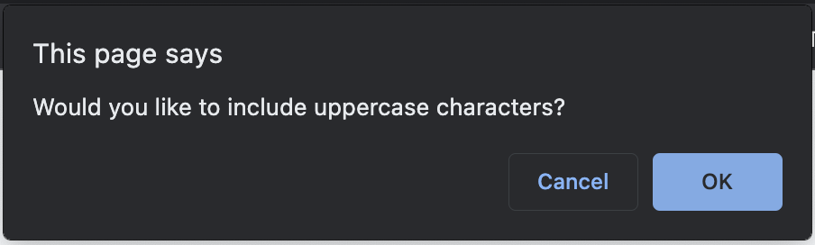
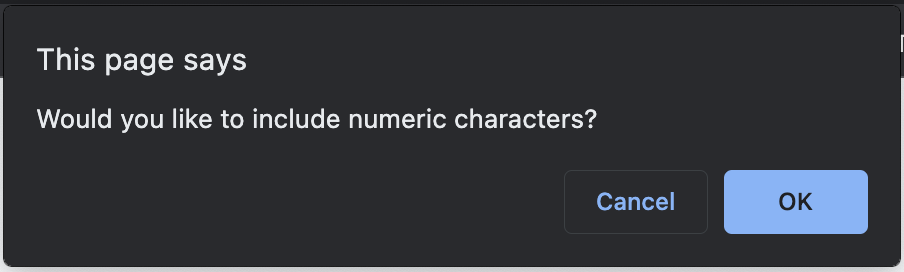
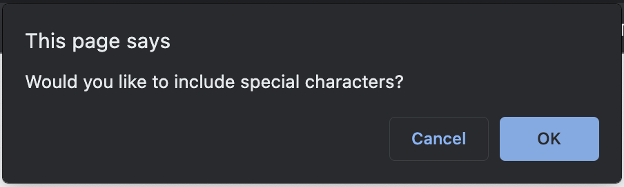
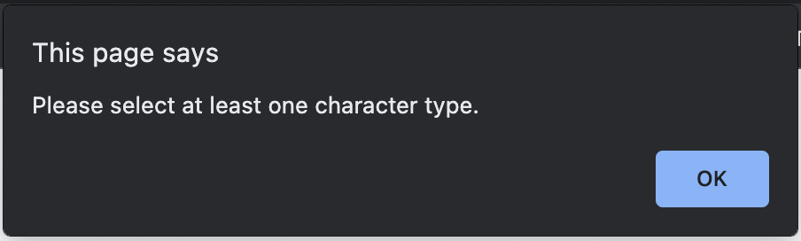

# Challenge-3-Password-Generator
Repository for UW Bootcamp week 3 challenge - Password Generator

# Challenge Requirements
## User Story

```
AS AN employee with access to sensitive data
I WANT to randomly generate a password that meets certain criteria
SO THAT I can create a strong password that provides greater security
```

## Acceptance Criteria

```
GIVEN I need a new, secure password
WHEN I click the button to generate a password
THEN I am presented with a series of prompts for password criteria
WHEN prompted for password criteria
THEN I select which criteria to include in the password
WHEN prompted for the length of the password
THEN I choose a length of at least 8 characters and no more than 128 characters
WHEN asked for character types to include in the password
THEN I confirm whether or not to include lowercase, uppercase, numeric, and/or special characters
WHEN I answer each prompt
THEN my input should be validated and at least one character type should be selected
WHEN all prompts are answered
THEN a password is generated that matches the selected criteria
WHEN the password is generated
THEN the password is either displayed in an alert or written to the page
```

# Installation

In order to meet the above criteria I used my knowledge of Javascript to add functionality to the existing webpage. When the user clicks on the 'generate password' button, they are asked a series of questions. 

The askPasswordLength() function is used to create the initial prompt asking the user for their desired password length between 8-128 characters. A while loop and if statement are used within the function to make sure the user response is in fact a number between 8-128 otherwise they are given an alert and the prompt is asked again. 

The askUser(characterType) function was created to create confirm windows asking the user if they would like to include a specific character type in their password. A loop calls this function for each of the four character types and an if statement is used to make sure the user selects at least one character type to break the loop, otherwise an alert pops up and the loop restarts. 

An empty array, selectArray, is created and based on the user's responses to the confirm windows, if statements are used to fill said array with all the preferred characters that can be used for the generated password.

An empty string, generatedPassword, is created and using the following for loop, a random character is selected from the available characters in selectArray and added to the string until generatedPassword is the desired length specified by the user.

```
for (var i = 0; i < passwordLength; i++) {
    generatedPassword += selectArray[Math.floor(Math.random() * selectArray.length)];
}
```

Finally the string generatedPassword string is returned by the generatePassword() function and that string is displayed on the page.

# Usage

The user clicks on the 'generate password' button and is asked a series of questions. 


The first prompts ask the user to input their desired password length between 8-128.


If the user does not input a number between 8-128 they are given an alert and the above prompt is asked again.


After inputting their desired password length, the following four windows appear asking the user what type of characters they would like to have used in their password.






If the user does not choose a single character type the following alert is given and the four questions above are asked again.


Once all the prompts are answered properly the page will generate a random password based on the user's responses.

[Link to page](https://genedkim.github.io/Challenge-3-Password-Generator/)